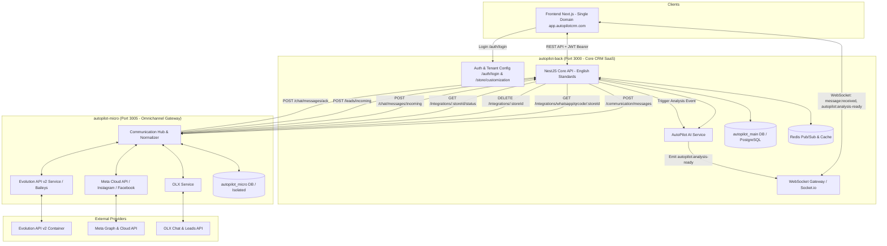

# 📋 Planejamento de Implementação: Boilerplate CRM White-Label + AutoPilot IA

> **Projeto**: AutoPilot CRM (Backend Boilerplate Multi-Tenant)  
> **Repositório**: `autopilot-backend` (NestJS + Prisma + PostgreSQL + Redis + Socket.io)  
> **Foco**: Concessionárias e Revendas de Veículos  
> **Domínio Único**: `app.autopilotcrm.com` (Login unificado com injeção dinâmica de branding pós-autenticação por concessionária)  
> **Principais Pilares**:
> 1. **Internacionalização Total (Código, Banco e Endpoints em Inglês Padronizado - "Deal")**  
> 2. **White-Label Dinâmico em Domínio Único (Logo, Cores, Regras por Concessionária aplicadas pós-login)**  
> 3. **Arquitetura Gateway com `autopilot-micro` (Evolution API v2, Meta Oficial, Instagram, Facebook, OLX)**  
> 4. **Comunicação em Tempo Real (WebSocket Gateway / Socket.io para Chat e AutoPilot IA)**  
> 5. **Módulo AutoPilot IA (Dossiê Estratégico e Respostas 1-Click com Controle Humano)**  
> 6. **Limpeza e Sanitização (Remoção total de Stripe e módulos legados)**

---

## 🏗️ 1. Visão Geral da Arquitetura do Ecossistema



---

## 🎯 2. Escopo e Decisões de Design Alinhadas

1. **Padrão de Nomenclatura Global em Inglês ("Deal" como Padrão de Vendas)**:
   - Todas as tabelas, colunas, enums, models do Prisma, DTOs e endpoints REST serão convertidos para **Inglês**.
   - O termo para negociações comerciais é estritamente **`Deal`** em toda a stack (eliminando `Attendance` e o legado `Atendimento`).
2. **`autopilot-micro` como Gateway Único Omnichannel**:
   - O `autopilot-back` **não** conversa diretamente com a Evolution API nem com APIs da Meta ou OLX. Toda comunicação externa é delegada ao `autopilot-micro`.
   - O `autopilot-back` consome o microsserviço com autenticação por header `x-micro-token` / `x-api-key`.
3. **Tempo Real com WebSockets no Backend**:
   - Implementação de um `ChatGateway` com `@nestjs/websockets` e `socket.io` no `autopilot-back`.
   - Ao receber mensagens via webhook do microsserviço (`POST /chat/messages/incoming`), o backend despacha o evento `message:received` para a sala da concessionária/chat.
   - O AutoPilot IA roda em segundo plano e emite `autopilot:analysis-ready` assim que o dossiê for atualizado.
4. **Domínio Único com White-Label Dinâmico**:
   - Sem necessidade de DNS Wildcard ou subdomínios por cliente: todos os usuários acessam um único domínio principal.
   - Ao logar com e-mail e senha, o JWT retorna os dados da concessionária (`storeId`), e o frontend carrega as cores e logotipo da loja via `GET /store/customization`.
5. **Controle Humano no CRM (Sem "Zero-Click" Autônomo)**:
   - A IA atua como **consultora e autopilot operacional de vendas**: gera dossiê e sugere respostas 1-click. Nenhuma mudança de status de funil ou envio de mensagem é feito sem a ação explícita do vendedor.
6. **Remoção de Cobranças Legadas (Stripe)**:
   - Eliminação de guards e tabelas de planos/assinaturas para transformar o produto em CRM B2B puro.

---

## 🌐 3. Fase 1: Internacionalização e Padronização (Português ➔ Inglês)

*Objetivo: Estabelecer o schema e a API no padrão internacional em inglês antes de construir novas features.*

### 3.1 De-Para de Banco de Dados (`prisma/schema.prisma`)

| Modelo Atual (PT) | Novo Modelo (EN) | Tabela Banco (`@@map`) |
| :--- | :--- | :--- |
| `Usuario` | `User` | `users` |
| `Loja` | `Store` | `stores` |
| `Colaborador` | `Employee` | `employees` |
| `Cargo` | `Role` | `roles` |
| `Cliente` | `Customer` | `customers` |
| `ClienteTemporario` | `TemporaryCustomer` | `temporary_customers` |
| `Atendimento` | **`Deal`** | **`deals`** |
| `VisitasAtendimento` | **`DealVisit`** | **`deal_visits`** |
| `TarefasAtendimento` | **`DealTask`** | **`deal_tasks`** |
| `ComentariosAtendimento` | **`DealComment`** | **`deal_comments`** |
| `LogAtividadesAtendimento` | **`DealActivityLog`** | **`deal_activity_logs`** |
| `Chat` | `Chat` | `chats` |
| `ChatResponsaveis` | `ChatAssignee` | `chat_assignees` |
| `Mensagem` | `Message` | `messages` |
| `MensagemPadrao` | `MessageTemplate` | `message_templates` |
| `Arquivo` | `File` | `files` |
| `Tag` | `Tag` | `tags` |

#### Atributos Principais:
- `criadoEm` ➔ `createdAt` | `atualizadoEm` ➔ `updatedAt`
- `nomeEmpresa` ➔ `companyName` | `documentoFiscal` ➔ `taxId`
- `temperatura` ➔ `temperature` (`HOT`, `WARM`, `COLD`)
- `modoAtendimento` ➔ `dealMode` (`BUY`, `SELL`, `CONSIGNMENT`)
- `origemAtendimento` ➔ `dealOrigin` (`WHATSAPP`, `INSTAGRAM`, `OLX`, `WEBMOTORS`, etc.)
- `remetente` ➔ `sender` (`CUSTOMER`, `STORE`)
- `conteudo` ➔ `content`
- `lido` ➔ `isRead`
- `motivoPerdido` ➔ `lostReason` | `subMotivoPerdido` ➔ `subLostReason`

### 3.2 Reestruturação de Diretórios e Módulos NestJS
```
src/
├── core/
│   ├── store/
│   │   ├── store.controller.ts
│   │   ├── store.service.ts
│   │   └── modules/
│   │       ├── deal/                 (era: atendimento)
│   │       │   ├── deal.controller.ts
│   │       │   ├── deal.service.ts
│   │       │   └── modules/ (task, visit, comment, activity)
│   │       ├── chat/
│   │       │   ├── chat.controller.ts
│   │       │   ├── chat.service.ts
│   │       │   ├── chat.gateway.ts   (WebSocket Gateway)
│   │       │   └── chat-webhook.controller.ts (Webhook do autopilot-micro)
│   │       ├── customer/             (era: cliente)
│   │       ├── employee/             (era: colaborador)
│   │       ├── role/                 (era: cargo)
│   │       ├── dashboard/
│   │       ├── reports/
│   │       └── message-templates/
│   ├── integration/                  (era: integracao - cliente do autopilot-micro)
│   │   ├── integration.controller.ts
│   │   ├── integration.service.ts
│   │   └── microservice.client.ts
│   ├── chat-ai/                      (Módulo AutoPilot IA)
│   │   ├── chat-ai.controller.ts
│   │   ├── chat-ai.service.ts
│   │   └── prompts/
│   └── user/
```

### 3.3 Padronização REST dos Endpoints Principais
- **Deals (Negociações)**:
  - `POST /deals`: Criação de negociação
  - `GET /deals`: Listagem e kanban
  - `GET /deals/:id`: Detalhes do deal
  - `PATCH /deals/:id/status`: Transição de etapa do funil
  - `POST /deals/:id/tasks`: Agendamento de tarefa
  - `POST /deals/:id/visits`: Registro de visita/test-drive
  - `POST /deals/:id/comments`: Comentário interno
- **Chats & Mensagens (Vendedor ➔ Cliente)**:
  - `GET /chats`: Listagem de chats
  - `GET /chats/:chatId/messages`: Histórico de mensagens
  - `POST /chats/:chatId/messages`: Envio de mensagem
  - `PATCH /chats/:chatId/read`: Marcar como lido
- **Webhooks Recebidos do `autopilot-micro` (Entrada Omnichannel)**:
  - `POST /chat/messages/incoming`: Nova mensagem recebida de qualquer canal
  - `POST /leads/incoming`: Novo lead criado externamente (OLX/Campanhas)
  - `POST /chat/messages/ack`: Atualização de status de envio/entrega da mensagem
- **Integrações (Gerenciamento pela Concessionária)**:
  - `GET /integrations/status`: Status unificado de canais da loja
  - `POST /integrations/whatsapp/connect`: Solicita criação de sessão e QR code
  - `DELETE /integrations/whatsapp`: Desconecta sessão do WhatsApp
  - `POST /integrations/whatsapp/verify-number`: Valida se número tem WhatsApp ativo

---

## 🧹 4. Fase 2: Limpeza e Desacoplamento (Sanitização)

*Objetivo: Eliminar módulos legados, travas de assinatura e limpar o schema.*

### 4.1 Limpeza no Schema (`prisma/schema.prisma`)
- [ ] **Remover Models**:
  - `Plano`
  - `Assinatura`
  - `HistoricoPagamento`
- [ ] **Remover campos no Model `Store`**:
  - `subscription` / `assinatura`
  - `stripeSubscriptionId`, `stripeCustomerId`, etc.
- [ ] **Executar Migração**:
  ```bash
  npx prisma migrate dev --name remove_subscriptions_and_translate_to_deal
  ```

### 4.2 Limpeza no Código NestJS
- [ ] Excluir pasta `src/webhook/webhook-stripe.*`.
- [ ] Excluir pasta `src/core/backoffice/modules/assinatura/`.
- [ ] Remover `@UseGuards(AssinaturaGuard)` de todos os controllers.
- [ ] Desinstalar dependência: `npm uninstall stripe @types/stripe`.
- [ ] Atualizar `.env.example` removendo chaves da Stripe e referências antigas.

---

## 🎨 5. Fase 3: Mecanismo White-Label & Customização da Concessionária

*Objetivo: Permitir identidade visual e regras dinâmicas por concessionária aplicadas dinamicamente após login.*

### 5.1 Novo Model no Schema Prisma (`StoreCustomization`)
```prisma
model StoreCustomization {
  id                    String   @id @default(uuid())
  storeId               String   @unique @map("store_id")
  slug                  String   @unique // ex: "autovip", "nortecarros"
  displayName           String   @map("display_name")
  
  // Visual Identity (White-Label)
  logoLightUrl          String?  @map("logo_light_url")
  logoDarkUrl           String?  @map("logo_dark_url")
  faviconUrl            String?  @map("favicon_url")
  loginBackgroundUrl    String?  @map("login_bg_url")
  primaryColor          String   @default("#1E40AF") @map("primary_color")
  secondaryColor        String   @default("#F3F4F6") @map("secondary_color")
  accentColor           String   @default("#3B82F6") @map("accent_color")
  
  // Store Business Settings
  openingTime           String?  @default("08:00") @map("opening_time")
  closingTime           String?  @default("18:00") @map("closing_time")
  workingDays           Json?    @map("working_days")
  commissionRules       Json?    @map("commission_rules")
  
  createdAt             DateTime @default(now()) @map("created_at")
  updatedAt             DateTime @updatedAt @map("updated_at")
  
  store                 Store    @relation(fields: [storeId], references: [id], onDelete: Cascade)
  @@map("store_customizations")
}
```

### 5.2 Endpoints de Customização (`StoreCustomizationModule`)
- [ ] `GET /store/customization`: Retorna as configurações de tema e horários da concessionária do usuário autenticado.
- [ ] `PUT /store/customization`: Atualiza cores, links de logotipo e horários de atendimento.
- [ ] `GET /public/tenants/:slug/config`: (Opcional) Permite pré-visualização ou fallback por parâmetro.

---

## ⚡ 6. Fase 4: Integração com `autopilot-micro` e WebSockets

*Objetivo: Operar mensageria omnichannel de alta estabilidade e entregar eventos em tempo real para o frontend.*

### 6.1 Comunicação com o Gateway Omnichannel (`autopilot-micro`)
Substituir chamadas legadas pelo cliente padronizado `MicroserviceClientService`:
- [ ] **Envio de Mensagem (`POST /communication/messages`)**:
  - Encaminha o DTO em inglês `SendMessageDto` contendo: `storeId`, `recipient`, `text`, `attachmentUrl`, `attachmentType`, `quotedMessageId`, `channel`, `messageId`, `wppApiType`.
- [ ] **QR Code e Conexão WhatsApp**:
  - `POST /integrations/whatsapp/connect` ➔ Chama `GET /integrations/whatsapp/qrcode/:storeId` no micro.
- [ ] **Desconexão de Sessão**:
  - `DELETE /integrations/whatsapp` ➔ Chama `DELETE /integrations/:storeId` no micro.
- [ ] **Status Consolidado de Canais**:
  - `GET /integrations/status` ➔ Chama `GET /integrations/:storeId/status` no micro.

### 6.2 Webhook Controller Normalizado (`chat-webhook.controller.ts`)
- [ ] Atualizar rotas para receber eventos do `autopilot-micro`:
  - `POST /chat/messages/incoming`:
    1. Persiste a mensagem na tabela `messages`.
    2. Identifica ou cria o `Deal` correspondente.
    3. Emite evento WebSocket `message:received` para a concessionária.
    4. Dispara a análise assíncrona do AutoPilot IA (se a mensagem for do cliente).
  - `POST /leads/incoming`:
    1. Cria o lead/cliente temporário e gera um novo `Deal`.
    2. Emite evento WebSocket `deal:created`.
  - `POST /chat/messages/ack`:
    1. Atualiza `idMensagemExterna` e status de confirmação da mensagem enviada.

### 6.3 Implementação do WebSocket Gateway (`src/core/store/modules/chat/chat.gateway.ts`)
- [ ] Adicionar dependências:
  ```bash
  npm install @nestjs/websockets @nestjs/platform-socket.io socket.io
  ```
- [ ] Criar `ChatGateway` com suporte a autenticação por JWT:
  - Eventos emitidos para o frontend:
    - `message:received`: Entrega imediata de novas mensagens na tela de chat.
    - `message:status`: Atualização de leitura/entrega.
    - `autopilot:analysis-ready`: Notificação de que o dossiê e sugestões foram atualizados pela IA.

---

## 🧠 7. Fase 5: Módulo AutoPilot IA (Dossiê & Respostas 1-Click)

*Objetivo: Fornecer raio-x da negociação e respostas rápidas estratégicas em segundo plano com controle 100% humano.*

### 7.1 Arquitetura do Processamento Assíncrono
1. Ao receber mensagem de cliente em `POST /chat/messages/incoming`, o backend agenda processamento na fila Redis / EventEmitter:
2. O `ChatAiService`:
   - Carrega as últimas 15 mensagens do chat + veículo anunciado (`externalAdId`).
   - Processa o prompt com LLM configurada.
   - Salva o resultado em cache Redis e na coluna `aiInsight` do chat.
   - Emite o evento `autopilot:analysis-ready` via `ChatGateway`.

### 7.2 Schema Consolidado do AutoPilot
```json
{
  "leadDossier": {
    "vehicleOfInterest": "Jeep Compass Longitude 2021",
    "hasTradeIn": true,
    "tradeInVehicle": "Onix 1.0 Manual 2018 (~60.000 km)",
    "paymentMethod": "Financing (Target down payment of R$ 30k)",
    "perceivedTemperature": "HOT",
    "mainObjection": "Concern about interest rates and trade-in valuation"
  },
  "nextBestAction": "Invite the customer for in-person evaluation of the trade-in vehicle and simulate with lower rate banks.",
  "quickReplies": [
    "Com certeza! O Compass está novíssimo. Para eu já adiantar uma pré-avaliação do seu Onix com o nosso perito, me envia a quilometragem e versão dele?",
    "Excelente escolha! Que tal dar um pulo aqui na loja hoje à tarde para fazer um test-drive e já avaliarmos seu Onix pessoalmente tomando um café?"
  ]
}
```

### 7.3 Endpoints REST do AutoPilot IA
- [ ] `GET /chats/:chatId/copilot`: Retorna o dossiê estratégico e sugestões de resposta consolidados (lê de cache/banco instantaneamente).
- [ ] `POST /chats/:chatId/copilot/refresh`: Permite ao vendedor solicitar uma reanálise imediata caso queira novas sugestões.

---

## 📦 8. Checklist de Homologação

- [ ] Schema traduzido para inglês com models `Deal`, `DealTask`, `DealVisit`, `DealComment`.
- [ ] Remoção completa de dependências e tabelas do Stripe.
- [ ] Integração com `autopilot-micro` funcionando via `POST /communication/messages` e endpoints de webhook.
- [ ] WebSockets ativos emitindo `message:received` e `autopilot:analysis-ready` para o front.
- [ ] Endpoint `/store/customization` fornecendo cores e logos corretos por concessionária autenticada.
- [ ] Docker Compose do backend rodando limpo (NestJS, Postgres, Redis) sem colisão de portas.


## Implementação no backend — 2026-10-01

- Código e diretórios do CRM renomeados para inglês, com `Deal` como entidade de negociação e preservação dos comentários existentes.
- Schema físico traduzido, baseline e migração transacional preparados; dados de CRM preservados. Tabelas de cobrança removidas pela migração.
- Stripe, módulos de planos/assinaturas, guards de assinatura e dashboard financeiro removidos.
- Customização por loja autenticada implementada em `/store/customization`; alteração restrita ao proprietário.
- Socket.io para frontend e cliente WebSocket opcional para o microsserviço implementados. Entrada por webhook permanece disponível; ambos usam fila persistente com deduplicação.
- Módulo de IA implementado com fila Redis, validação de saída, persistência do dossiê e sugestões sujeitas à revisão humana.
- Testes de isolamento, ingestão, IA e migração adicionados. A migração não foi executada no banco configurado do projeto.

Para implantação, seguir `docs/MIGRATION.md`. O contrato a implementar no microsserviço e no frontend está em `docs/COMMUNICATION.md`. A homologação com provedores reais depende desses outros serviços e das credenciais. O Docker Compose foi atualizado, mas a execução dos contêineres depende do Docker local ativo.
